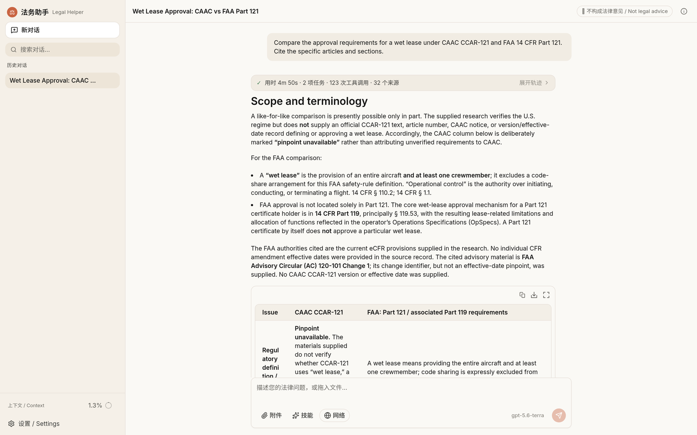
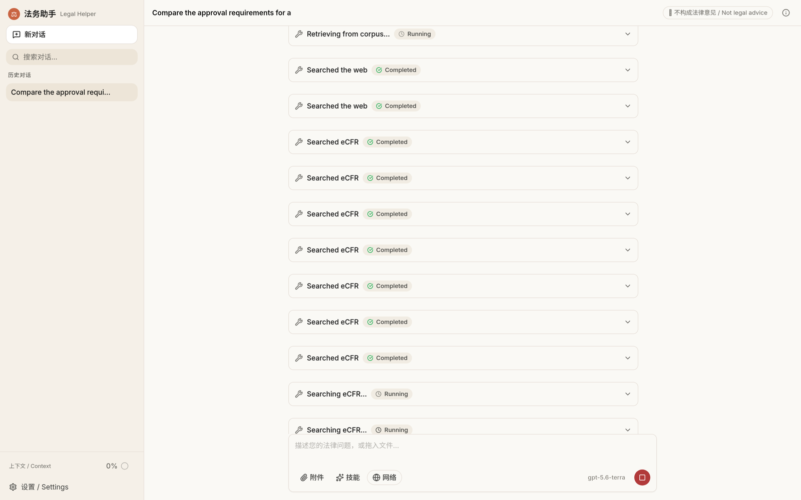
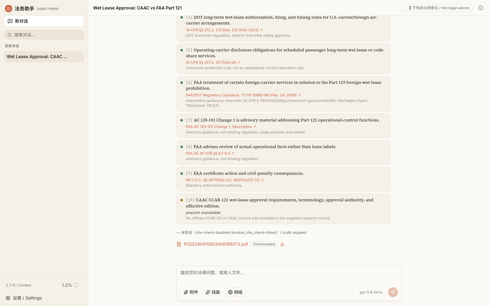
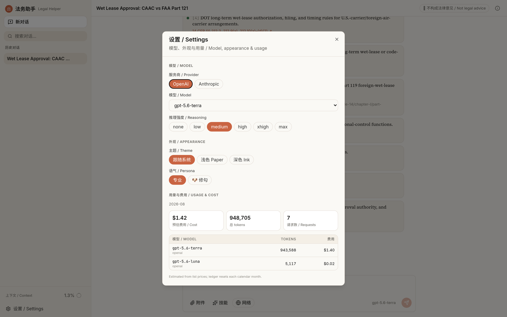
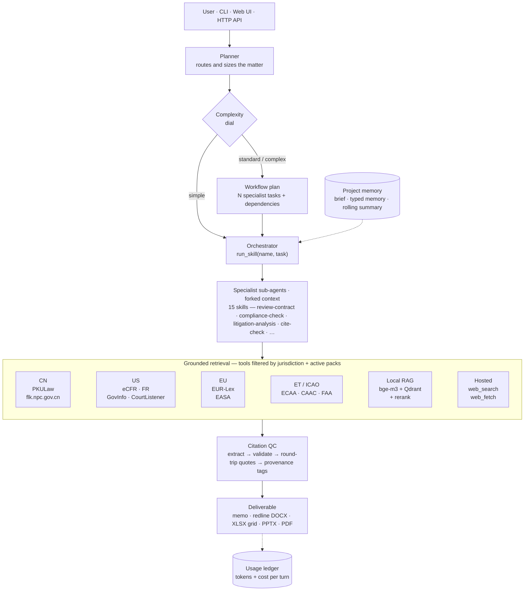

<div align="center">

# ⚖️ Lawgent

**An open-source legal AI agent — grounded, multi-jurisdiction, citation-verified.**

Plans the matter, fans out specialist sub-agents, pulls primary law from official sources,
round-trips every quotation against the document it came from, and returns a filed-ready
memo, redline, workbook, or deck.

<br/>


-F59E0B)


</div>

> [!NOTE]
> **Who it is for.** Built for a practising lawyer, to take the grind out of the
> research-and-citation part of the job: a solo practitioner, an in-house team of one, or
> anyone who has to be right about the law in more than one country. The legal-skill
> structure and the citation-verification approach build on prior work credited in
> [acknowledgements](#acknowledgements). [Current limitations](#status-and-known-gaps) are
> listed in full.

> [!IMPORTANT]
> **Not legal advice.** This harness assists with legal workflows. Every output must be
> reviewed by qualified counsel before it is relied on for advice, filings, negotiations,
> or operations. Citation verification is a safety net, not a substitute for a lawyer.

---

## Table of contents

- [What it is](#what-it-is)
- [What it looks like](#what-it-looks-like)
- [Architecture](#architecture)
- [Quickstart](#quickstart)
- [Multi-nation: one harness, many legal systems](#multi-nation-one-harness-many-legal-systems)
- [Multi-area: skills and domain packs](#multi-area-skills-and-domain-packs)
- [External procedural skills](#external-procedural-skills)
- [The tool surface](#the-tool-surface)
- [The grounding stack](#the-grounding-stack)
- [Runtime internals](#runtime-internals)
- [Web UI and HTTP API](#web-ui-and-http-api)
- [Configuration](#configuration)
- [Repository layout](#repository-layout)
- [Testing](#testing)
- [Status and known gaps](#status-and-known-gaps)
- [Acknowledgements](#acknowledgements)

---

## What it is

Most "legal AI" is a chat box in front of a general model: it answers fluently, invents
article numbers, and knows one legal system. This repository is the other thing — the
**harness** around the model that makes legal output checkable.

Three commitments shape every design decision:

**1. Primary sources, not recollection.** Statutes, regulations, and judgments are fetched
live from official databases — 国家法律法规数据库, PKULaw, eCFR, the Federal Register,
GovInfo, CourtListener, EUR-Lex, ECAA, CAAC — through in-process connectors and MCP
servers. Model memory is allowed only when it is tagged as such.

**2. Every claim carries a pinpoint, and every pinpoint is verified.** Answers end with a
`## Sources` / `## 资料来源` block in which each entry names a 条款 / article / section / §.
A grounding pass re-fetches the cited documents and round-trips the quoted language against
them; citations that do not survive are flagged, not quietly kept.

**3. Jurisdiction is a first-class axis.** The source hierarchy, citation style, output
language, and visible tool set all change when the jurisdiction changes. PRC law is the
default frame (法律 → 行政法规 → 部门规章 → 规范性文件 → 司法解释 → 指导案例); US and EU
are first-class comparative systems; ET and ICAO ship with the aviation pack.

Around those commitments sit a planner that sizes the work to the question, a sub-agent
runtime that keeps each specialist's context clean, durable project memory for matters
that outlive a single chat, a document layer that writes real DOCX tracked changes and
native PPTX shapes, and a per-turn cost ledger.

---

## What it looks like

Real runs against live sources, captured from the web UI. (In-product branding is
**法务助手 / Legal Helper** — Lawgent is the project name.)

**The answer.** A comparative CN/US question. The chip above the answer reports the run:
elapsed time, number of specialist tasks, tool calls, and distinct sources. Note what the
comparison table does in the CAAC column — it says *pinpoint unavailable* instead of
inventing an article number, because no official CCAR-121 text made it into the record.



**Tool use, live.** While the run works, every connector call appears as its own card with
running / completed / error state — eCFR, GovInfo, PKULaw, the local corpus, hosted web
search. Nothing about the retrieval is hidden from the reviewer.



**Sources with pinpoints.** Each authority carries its pinpoint (`14 CFR §§ 212.2, 212.9(a)`,
`49 U.S.C. §§ 44709(a)–(c)`) and a note on what it is and is not good for. Entry [10] is the
one that matters: the harness would rather publish *pinpoint unavailable* than a plausible
citation it could not verify.



**Settings and the cost ledger.** Switch provider, model, and reasoning effort mid-matter;
the month-to-date token and cost ledger is broken out per model, priced with each provider's
own cache-billing semantics.



---

## Architecture



Both providers see **the same tool surface**: connectors, MCP-discovered tools, RAG,
citation tools, and document writers are all registered as plain function tools. No
provider-native MCP path, no Claude-only or GPT-only branch in the CLI, server, or skills.

---

## Quickstart

```bash
# 1. Environment (Python + Node toolchains live side by side)
conda create -n llm python=3.11 && conda activate llm
pip install -r requirements.txt
npm install                      # web UI + mermaid CLI for flowchart rendering

# 2. Keys — at minimum one provider key
cp .env.example .env             # ANTHROPIC_API_KEY / OPENAI_API_KEY / PKULAW_API_TOKEN / …

# 3. Ask it something
python -m legal_helper run --task "Review this NDA for PRC-law exposure" \
    --input examples/general/sample_commercial_nda.md

# 4. Or use it interactively
python -m legal_helper chat                  # streaming REPL
python -m legal_helper serve --port 8010     # FastAPI + React UI
```

Switch legal systems and domains per invocation:

```bash
python -m legal_helper run --jurisdiction US --task "Does 14 CFR 121 permit this wet lease?"
python -m legal_helper run --domain-pack aviation \
    --task "Review this dry-lease against the playbook" \
    --input examples/aviation/sample_aircraft_lease.md
```

Switch providers with one environment variable — everything else is identical:

```bash
MODEL_PROVIDER=anthropic python -m legal_helper chat
MODEL_PROVIDER=openai    python -m legal_helper chat
```

### API keys and what unlocks what

| Variable | Unlocks | Required? |
|---|---|---|
| `ANTHROPIC_API_KEY` | Claude provider path, hosted web search/fetch | one provider key required |
| `OPENAI_API_KEY` | GPT provider path, hosted web search/fetch | one provider key required |
| `PKULAW_API_TOKEN` | The nine PKULaw MCP sub-services (primary PRC lookup) | optional — falls back to flk.npc.gov.cn |
| `GOVINFO_API_KEY` | GovInfo (US Code, CFR, bills, CRS) | optional |
| `COURTLISTENER_API_TOKEN` | Higher CourtListener rate limits | optional |

No key is ever read from the repository: they come from `.env` or the process environment.

---

## Multi-nation: one harness, many legal systems

Jurisdiction is not a prompt hint — it is a runtime filter. `filter_for(jurisdictions,
packs)` in `legal_helper/connectors/__init__.py` decides which connectors a sub-agent can
even see, so a PRC question is never answered out of the Federal Register by accident, and
an EU question surfaces EUR-Lex and EASA rather than eCFR.

| Jurisdiction | Primary-source stack | Tools the agent gets |
|---|---|---|
| 🇨🇳 **CN** (default) | PKULaw (statutes, 司法案例, 检察文书, 律所文章), 国家法律法规数据库 | `pkulaw_*` (9 MCP sub-services), `flk_npc_search`, `flk_npc_fetch`, `caac_local_search/fetch` |
| 🇺🇸 **US** | eCFR, Federal Register, GovInfo, CourtListener | `ecfr_search/fetch`, `federal_register_search/fetch`, `govinfo_search/fetch`, `courtlistener_search/fetch`, `faa_title14_search`, `drs_search` |
| 🇪🇺 **EU** | EUR-Lex (CELEX + SPARQL), EASA | `eurlex_search/fetch`, `easa_ad_search/fetch`, `easa_ear_index` |
| 🇪🇹 **ET** | Federal Negarit Gazeta mirror, ECAA | `ethiopia_law_search/fetch`, `ecaa_index`, `ecaa_fetch` |
| ✈️ **ICAO** | Chicago Convention + annexes, ICAO docs, Cape Town / IDERA | local RAG collections `icao_doc`, `aviation_treaties` |
| 🇬🇧 **UK** / 🇭🇰 **HK** | Configurable jurisdiction codes; served today by hosted web search + fetch with grounding | `web_search`, `web_fetch`, `fetch_url_to_artifact` |

**Comparative work is the normal case.** Ask "compare CCAR-121 and 14 CFR Part 121 wet-lease
approval" and the planner opens one research task per legal system, each with its own
connectors, then an integration task that reconciles them into a single memo — with the PRC
and US pinpoints kept separate and separately verified.

Three more things travel with the jurisdiction:

- **Citation style** — `gb_t_7714` (PRC), `bluebook` (US), `oscola` (UK), converted by
  `legal_helper/citations/format.py`.
- **Language** — user-facing output follows the user's language; primary sources are quoted
  in the original with a translation added when the languages differ. Internal reasoning is
  free to run in whichever language fits the material.
- **Source hierarchy** — encoded in `legal_helper/playbook/general_playbook.md`, so a PRC
  answer ranks 法律 above 部门规章 above 规范性文件 without being told each time.

---

## Multi-area: skills and domain packs

### 15 practice skills

Each skill is a progressive-disclosure bundle: a `SKILL.md` under 100 lines (the manifest a
sub-agent starts with), `references/` prose it pulls only when needed, `resources/` output
templates, and `scripts/` deterministic helpers. Context stays small until depth is actually
required.

These fifteen ship in-tree and are legal methodology. Skills discovered from a configured
external root are a different kind — see [external procedural skills](#external-procedural-skills)
— and the authoring contract above deliberately does not apply to them.

| Skill | What it does |
|---|---|
| `review-contract` | Clause-by-clause review against a configurable playbook, with deviations, business impact, and redlines |
| `triage-nda` | Fast NDA classification — GREEN (sign) / YELLOW (counsel) / RED (full review) |
| `draft-agreement` | Drafts bilingual PRC-first agreements and litigation documents from deal terms |
| `docx-redline` | Native Word tracked changes (`w:ins`/`w:del`) plus anchored margin comments |
| `compliance-check` | Statutes, approvals, filings, and reporting duties for a proposed action, product, or data flow |
| `legal-risk-assessment` | Severity × likelihood matrix with escalation triggers |
| `litigation-analysis` | 案情分析 / 争议焦点归纳 — claims and defenses mapped to legal elements with verified authority |
| `legal-response` | Structured replies to regulators, enforcement letters, and counterparty demands |
| `meeting-briefing` | Negotiation and authority-meeting preparation packs |
| `brief` | Daily scan, topic research, or incident briefing |
| `vendor-check` | Third-party diligence — standing, sanctions screening, certificates, ESG |
| `signature-request` | Multi-party closing and execution packages with a signature matrix |
| `tabular-review` | Document grids — one row per document, one column per question, pinpoint cite in every cell |
| `cite-check` | Round-trips every citation and quotation against its primary source |
| `flowchart` | Process maps and decision trees as editable PPTX shapes or standalone images |

### Domain packs

A **domain pack** layers subject-matter depth on top of the generic skills without forking
them. A pack is a `pack.yaml` (jurisdictions, allowed connectors, RAG collections), a
`playbook.md`, `references/`, and `overlays/<skill>.md` deltas merged into the skill manifest
when the pack is active.

```
legal_helper/domains/aviation/
├── pack.yaml                    # CN · US · EU · ET · ICAO, connectors, RAG collections
├── playbook.md
├── references/ethiopia.md
└── overlays/                    # 13 per-skill deltas
    ├── review-contract.md       # → lease/purchase clause taxonomy, Cape Town, IDERA
    ├── compliance-check.md      # → CAAC / FAA / EASA / ECAA approval chains
    └── …
```

**Aviation** is the populated pack today: CAAC / MOT / FAA / EASA / ICAO, Cape Town
Convention and IDERA, sales and leasing, charter and wet-lease, MRO / Part-145, hull and
liability insurance, accident investigation, ITAR / EAR, CORSIA. Everything aviation-specific
lives inside that directory — the core stays domain-agnostic, and an anatomy test enforces it.

Adding a pack (healthcare, fintech, employment, data protection) means creating a directory
with the same four pieces; it is auto-discovered on the next process start. No core code
changes.

---

## External procedural skills

The fifteen in-tree skills are legal methodology: a `SKILL.md` body is inlined into a
sub-agent along with the PRC playbook, because that *is* the skill's content. A second kind
of skill lives outside the package and works the other way round — it carries its own
multi-step workflow, reference tree, artifact contracts and gate scripts, and what it needs
from a host is only the three things a host knows: where it lives on disk, which calls stand
in for read/write/execute, and which of its interactive assumptions do not hold.

[ppt-master](https://github.com/hugohe3/ppt-master) is the motivating case. It authors one
SVG per page, compiles them to native DrawingML, and gates the result with its own quality
checker. Lawgent drives the official distribution unmodified:

```bash
# install it under a skill root (Claude Code's user directory is scanned by default)
git clone https://github.com/hugohe3/ppt-master ~/.claude/skills/ppt-master

python -m legal_helper chat
# > 用 ppt-master 做一份关于……的汇报 PPT
```

Discovery scans `skill_roots()`: **this package is always first and cannot be configured
away**, so a mistyped root can never remove the legal skills. `LEGAL_HELPER_SKILL_ROOTS`
(`os.pathsep`-separated) replaces the *external* roots only, and an earlier root shadows a
later one so a third party cannot silently replace a methodology.

Three capabilities make driving possible, and none of them existed before: `write_text_file`
(sandboxed to `outputs/` — not the project root, which holds the source tree),
`run_skill_script` (argv list, no shell, and the script must resolve *inside* a discovered
skill's own directory), and `list_skill_dir`. A non-zero exit from a skill's script is
returned as data, because that is how its gates reach the model.

Such a skill is given a **host runtime contract** instead of legal methodology: its resolved
`SKILL_DIR`, the call mapping, and the two assumptions that fail here — there is no
interactive channel, so blocking user gates run under the skill's own explicit-delegation
provision and the decision is reported; and there are no background processes, so a preview
server is never started. It also gets its own tool-loop budget
(`external_skill_max_iterations`, default 80): the research budget of 8 is tuned for a
specialist that fetches a few sources and writes prose, and cannot reach a procedure's export
step at all.

> **Trust boundary.** A script under a configured root runs with the harness's privileges —
> that is what "drive this skill" means. Roots are operator-configured; never point one at a
> directory the model can write to, or `write_text_file` and `run_skill_script` compose into
> arbitrary code execution.

---

## The tool surface

Around 80 in-process function tools, plus the nine PKULaw MCP services and the hosted
web search / fetch pair. They are assembled per turn from the active skill, jurisdictions,
and packs — never all at once, so provider tool schemas stay small.

<details open>
<summary><b>Legal research and retrieval</b></summary>

| Tool | Purpose |
|---|---|
| `legal_source_search` | Jurisdiction-aware fan-out across the connector layer |
| `ecfr_search` · `ecfr_fetch` | US Code of Federal Regulations, current and historical |
| `federal_register_search` · `federal_register_fetch` | Rules, proposed rules, notices |
| `govinfo_search` · `govinfo_fetch` | US Code, CFR, bills, committee and CRS material |
| `courtlistener_search` · `courtlistener_fetch` | US case law and dockets |
| `eurlex_search` · `eurlex_fetch` | EU law by CELEX / title / SPARQL |
| `flk_npc_search` · `flk_npc_fetch` | 国家法律法规数据库 (free PRC fallback) |
| `pkulaw_*` (9 MCP services) | PRC statutes by 条号, semantic statute and case search, 案号 recognition, 法条 traceback, citation validation, doc linking, NL search |
| `ethiopia_law_search/fetch` · `ecaa_index/fetch` | Ethiopian proclamations and ECAA regulations |
| `faa_title14_search` · `drs_search` · `easa_ad_*` · `caac_local_*` | Aviation regulators (pack-gated) |
| `retrieve_legal` | Local RAG over ingested corpora |
| `web_search` · `web_fetch` · `fetch_url_to_artifact` | Hosted search, hosted fetch, and pinned-to-disk fetch |

</details>

<details open>
<summary><b>Citations, grounding, and QC</b></summary>

| Tool | Purpose |
|---|---|
| `extract_citations_tool` | eyecite (US) + PRC regex (案号, 法释, 国函, 国办发, 部令, 《…》第X条) |
| `validate_citations_tool` | Structural and existence checks per jurisdiction |
| `quote_roundtrip_tool` | Does the quoted language actually appear in the source? |
| `ground_answer_tool` | Full pass: find cites → fetch each source → round-trip every quote → grounding score |
| `provenance_audit_tool` | Enforces provenance tags (`[PKULaw]`, `[CourtListener]`, `[model knowledge — verify]`, `[settled — last confirmed YYYY-MM-DD]`) |
| `cite_check_report_tool` | Reviewer-facing verdict table |
| `verification_log_append_tool` | Append-only audit trail of what was checked, when, against what |

</details>

<details open>
<summary><b>Documents in, documents out</b></summary>

| Family | Tools |
|---|---|
| Read / inspect | `read_document`, `inspect_docx`, `inspect_pdf`, `inspect_xlsx`, `inspect_xlsx_range`, `inspect_pptx`, `extract_pdf_tables`, `extract_clauses` |
| Write | `write_docx`, `write_pdf`, `write_xlsx`, `write_pptx`, `write_pptx_from_html` (lay slides out in HTML/CSS, measured in headless Chromium and mapped onto native PowerPoint shapes/text/tables), `read_deck_stylesheet` |
| Edit in place | `edit_docx_text`, `edit_xlsx_cells`, `edit_xlsx_cells_checked` (guarded, with protected ranges), `edit_pptx_text`, `copy_xlsx_sheet`, `reshape_docx/xlsx/pptx` |
| Prove the edit | `diff_xlsx`, `render_docx_pages`, `render_xlsx_pages`, `render_pptx_slides`, `render_pdf_pages`, `view_image` — the `render_*` tools return the rendered pages **as images**, so the model inspects its own output instead of trusting a path |
| PDF surgery | `merge_pdfs`, `split_pdf`, `rotate_pdf_pages` |
| Diagrams | `render_flowchart_image`, native PPTX flowchart shapes |
| Redlining | Real `w:ins` / `w:del` revision marks plus `w:commentRangeStart`-anchored comments — the file a partner can accept or reject in Word |

</details>

<details open>
<summary><b>Orchestration and memory</b></summary>

| Tool | Purpose |
|---|---|
| `run_skill` | Dispatch a task to a specialist sub-agent with a forked context — an in-tree legal skill, or an [external procedural skill](#external-procedural-skills) |
| `write_text_file` | Author a text artifact (SVG, Markdown, JSON) under `outputs/`; what lets a procedural skill build its own files |
| `run_skill_script` | Run one of a skill's own Python scripts — its gates and exporters. Argv list, no shell, confined to that skill's directory |
| `list_skill_dir` | List a skill's own tree so its reference paths are read rather than guessed |
| `list_skill_sections` · `read_skill_section` · `list_skill_references` · `read_skill_reference` | Progressive disclosure of skill depth |
| `read_playbook_section` | Pull the relevant playbook section only |
| `project_memory_write` · `project_memory_search` · `project_brief_read` | Durable cross-chat matter memory |
| `list_format_recipes` · `read_format_recipe` | House formatting rules for deliverables |

</details>

---

## The grounding stack

Citation discipline is layered, because a single check catches a single failure mode.

| Layer | Failure it catches | Implementation |
|---|---|---|
| **Extraction** | — | `eyecite` + `reporters-db` for US; regex for PRC 案号 / 法释 / statute pinpoints; EU CELEX |
| **Structural validation** | Malformed or impossible citations | `citations/validate.py`, per-jurisdiction |
| **Existence check** | Cites to documents that do not exist | Connector / PKULaw round-trip; PRC cites stay `could_not_check` until a real lookup promotes them to `verified` |
| **Quote round-trip** | Real source, invented quotation | `citations/groundedness.py` — fetch the source, match the quoted language |
| **Support check** | Real source, real quote, wrong proposition | `cite-check` Mode 2 — does the passage support the claim it is cited for? |
| **Provenance tags** | Model recall presented as retrieval | `citations/provenance.py` — retrieval tags vs. verify tags |
| **Pinpoint audit** | "See the Company Law" with no article | `audit_citations` requires a pinpoint per entry, or an explicit `pinpoint unavailable` / `无法获得具体条款` |

The workflow runs citation QC as its own task when the answer's stakes warrant it, and the
web UI renders the verdict as a reviewer-facing card: what was checked, what passed, what
needs a human.

**The audit runs before you read the answer, and it repairs.** A substantive legal answer is
synthesised into a buffer, audited, and only then revealed — so a citation that does not
support its claim is fixed rather than labelled. When the audit fails, a bounded repair pass
(`max_repair_rounds`, default one round) gets the draft plus the critical findings and has to
fix exactly those: re-verify with the tools, correct the pinpoint if the source supports the
claim, change or drop the claim if it does not, and never substitute an invented citation.
Research progress, tool calls and phases stream live throughout, so the run stays visible
while the prose is held back. `verify_before_reveal: false` restores stream-then-label.

---

## Runtime internals

**Planner and complexity dial.** A routing pass classifies each request `simple` /
`standard` / `complex` and emits a `WorkflowPlan` of agent tasks with dependencies. Simple
questions get one agent and a direct answer; a comparative multi-jurisdiction memo gets a
fan-out sized to the question plus an integration task. Fan-out is derived from the matter,
never a fixed count.

**Sub-agent runtime.** Each specialist starts from a compact manifest in a forked context
and pulls depth on demand. Only its final block returns to the orchestrator; its internal
turns stay in the JSONL log under the same parent `run_id`. The orchestrator, not the
specialist, authors the user-facing answer.

**Deliverables are measured before they are handed over.** A legal deliverable is a
document, and a document either reads well or it does not. The Excel path's discipline —
write, measure, look, repair, re-measure — generalises to every generated deck and memo,
with the deterministic layer first because it costs nothing:

1. **Conformance** (`documents/quality.py`). Shapes off the canvas, overlap past 2% of the
   smaller shape, text that cannot fit its box (CJK-aware, reading the frame's real insets),
   runs under the 11pt body / 9pt label floor, WCAG contrast, empty placeholders. Findings
   carry slide and shape indices, so a finding names a place to go and look. A check earns
   its place here only when a pass means "nothing is provably broken" — the occupancy
   measures that once lived here were deleted after testing them against 89 slides of real
   work, where they ranked an empty generated slide above a dense statutory one and flagged
   nothing but correct work. Style is never encoded; it is guided, and the model decides.
2. **The pages, as pixels.** Rendering a file the model authored returns a contact sheet
   *and* the lint findings *and* a next step, as an image result — so the pages arrive as
   something the model sees rather than a path it has to choose to open. A file it is
   merely reading is marked as such, because telling a model to repair a source PDF it
   never wrote just produces repeat renders.

Measuring is automatic once a render happens; whether to look is still the model's call.
There is no enforced repair loop in the tree — one was built and reverted — so a deck is
only as reviewed as the turn that produced it. For decks where that is not good enough,
drive [ppt-master](#external-procedural-skills), whose own quality gate is a hard stop.

**Diagrams are geometry, not pictures.** `documents/graph_layout.py` asks Graphviz for node
boxes, routed edge polylines, arrowhead tips and edge-label positions in slide inches, and
the emitter turns them into native PowerPoint shapes — editable boxes and arrows, not a
PNG. Flowcharts (from a Mermaid string), 思维导图 and 结构图 (from an outline) are the same
geometry problem with different reading conventions. The fit adjusts *type size* and
re-measures the boxes around it, rather than scaling the drawing and leaving the text
behind. Mermaid stays as an authoring syntax and as the raster renderer; `d2` is there for
the one arrangement Graphviz does not match, nested containers.

**Provider parity.** One `Provider` protocol over Anthropic (`claude-opus-5-5`; fast tier
`claude-sonnet-5`) and OpenAI (`gpt-6-sol`; fast tier `gpt-6-luna`). Streaming, tool calls, reasoning traces, prompt caching,
and hosted web search all reach parity, and `tests/test_provider_parity.py` asserts the tool
surfaces match.

**Two kinds of memory.** `context.py` keeps a *single long chat* inside the window with a
CJK-aware token estimator and budgeted recent-message selection — so a 40-page pasted
contract is not truncated to 3 000 characters. `projects.py` keeps *many chats* on one matter
coherent: a hand-authored brief re-injected every turn, append-only typed memory (fact /
decision / task / open_question / glossary / artifact / risk / source) ranked by salience, a
rolling summary, and compaction.

Both rolling summaries are maintained by **delta, not rewrite**. Re-summarizing a summary
erodes a little detail every pass — a failure mode named *context collapse* — so instead the
fast model is asked only for what changed, as `+ Section | …` / `- Section | …` lines against
a sectioned playbook (Goals / Facts / Conclusions / Artifacts / Open), and a deterministic
merge applies them. Bullets accumulate and disappear only when the model says so or a section
hits its cap, so loss is bounded and visible rather than emergent. A delta that will not parse
leaves the prior playbook untouched.

**Compaction is tier-aware, and priced.** When to fold older turns into the summary depends
on the model, not on a universal constant: strong models do better carrying the raw
transcript further and isolating side quests in sub-agents, while cheaper models degrade
sooner and benefit from summarizing early. Frontier models compact at 75 % of the input
window, the fast tier at 55 %. Two things bound that share. The *input* window is the window
minus the output ceiling, because a provider window is shared between the two. And on OpenAI
the trigger is additionally capped below the 272 K long-context cliff: a fraction of the
window alone put it at 750 K on a 1 M-token model while the surcharge began at 272 K, which
is how 6 % of requests came to carry half the bill. The decision itself uses the token count
the provider reported for the last turn — which counts the system prompt, the tool schemas
and every tool result — and falls back to the local estimate only when no usage has arrived
yet. `chat_compaction_threshold` pins the window share; it never raises the cliff.

**Tool results have a budget.** A statute body, a court opinion or a wide retrieval used to
enter the context at whatever size the source happened to be, and stay there for the rest of
the turn. Each tool now declares how much of its output may reach the model, measured in
tokens rather than bytes — the same 50 KB is ~12 K tokens of English and ~50 K of Chinese.
Over-budget results either truncate with the loss stated, or spill to `state/tool_results/`
and hand back a path the model can page through with `read_document(path=…, offset=…,
limit=…)`, so the evidence stays reachable without being resident. A 245 K-token statute
becomes 12 K in context and one call away. A turn's cumulative tool output is capped as
well; past the cap a tool returns a notice to answer from what is already gathered, so every
tool call still gets a well-formed result. Two things are never cut: anything carrying inline
images, and anything that *is* the deliverable — a sub-agent's finished answer, a cite-check
report — because truncating those shortens the memo instead of the evidence.

**Runs are durable.** Each run writes its phases to `state/runs/<run_id>/artifacts/` as they
complete — the plan, every research bundle, the draft, each audit, each repair — alongside a
snapshot and an event log. A cancel or a provider outage finishes the run as `paused` rather
than discarding it, and passing that `run_id` back as `resume_run_id` reuses the completed
bundles instead of re-running the research. For a run that is thirty primary-source lookups
deep before it writes a word, that is the expensive half of the turn. `GET /api/runs` lists
what is resumable. Every write is best-effort: durability can never fail a turn.

**Documents: inject one, navigate many.** A single attached document is pasted into the
prompt — that is where full context genuinely wins. A *corpus* of them is not: past a total
size threshold each text attachment is replaced by a navigable outline (its headings and
第X条 / Article N labels, drawn from the same patterns the RAG chunker uses) plus the
`read_document` call that opens it, so the model reads the parts it needs instead of
everything. `LEGAL_HELPER_INLINE_CORPUS_BYTES=0` turns this off.

**Local RAG.** bge-m3 embeddings and an embedded Qdrant under `state/qdrant/`, with a
legal-aware hierarchical chunker that respects 第X条 / Article X / § X / clause-numbering
boundaries. Retrieval is hybrid dense + sparse with RRF fusion, over-retrieves 3–4×, then
re-ranks locally with a cross-encoder. Nothing in the retrieval hot path leaves the machine.

```bash
python -m legal_helper.rag.ingest --collection general --seed
python -m legal_helper.rag.ingest --collection aviation --seed
python -m legal_helper.rag.ingest --collection user --path ~/my_legal_docs/
```

**Cost ledger.** Every provider turn — both providers, both the run and streaming paths —
appends normalized token usage to `state/usage/usage-YYYY-MM.jsonl`, priced with
per-provider billing semantics: Anthropic bills cache reads and writes as separate buckets;
OpenAI's cached tokens are a discounted subset of input, and a prompt over 272 K input tokens
is billed at 2× input / 1.5× output for the whole request. That long-context surcharge is
easy to overlook and expensive to ignore — it is modelled, and `long_context_requests` in the
month summary says how often it fired. `GET /api/usage` serves the summary and the UI renders
it. Recording never breaks a turn.

**Trajectory failure profile.** Outcome-level checks cannot see a correct answer reached
through a broken chain. Every workflow failure or degradation event is tagged with a subclass
across two layers — *substantive* (the law is wrong) and *procedural* (the agent misbehaved)
— and `citations/trajectory.py` aggregates a per-run profile, including a
right-answer-wrong-reason flag for runs that produced clean output on a chain that broke.

**Observability.** JSONL event and turn records under `logs/` capture provider, model,
messages, tool calls, usage, latency, and the parent/sub `run_id` tree — enough to replay
why an answer said what it said.

---

## Web UI and HTTP API

`python -m legal_helper serve --port 8010` starts FastAPI plus a React 19 + Vite front end
with SSE streaming.

- **Live trajectory** — plan, per-agent tasks, tool calls, and reasoning as they happen
- **Sources rail** — every retrieved authority with its provenance tag and pinpoint
- **Citation audit card** — the cite-check verdict inline with the answer
- **Artifacts** — generated DOCX / PDF / XLSX / PPTX attached to the message that produced them
- **Projects** — brief, memory, and compaction controls for long-running matters
- **Cost center** — month-to-date tokens and spend by model
- **Uploads** — drop a contract or PDF into the chat and cite it

Selected endpoints:

```
POST /api/chats                          GET  /api/chats/{id}
POST /api/chats/{id}/messages/stream     GET  /api/chats/{id}/runs/{run_id}/stream
POST /api/chats/{id}/upload              GET  /api/chats/{id}/artifacts/{artifact_id}
GET  /api/projects                       POST /api/projects/{id}/memory
POST /api/projects/{id}/compact          GET  /api/usage
GET  /api/skills                         GET  /domains        GET /jurisdictions
GET  /api/runs                           GET  /api/runs/{run_id}
```

---

## Configuration

`config.yaml` holds runtime defaults; `.env` and the process environment override it.

```yaml
provider: openai                  # anthropic | openai

default_jurisdiction: CN          # CN | US | EU | UK | HK | ET | ICAO
secondary_jurisdictions: [US, EU] # comparative systems surfaced when relevant
default_language: zh              # user-facing default; follows the user at runtime
citation_style: gb_t_7714         # gb_t_7714 | bluebook | oscola
active_domain_packs: []           # e.g. [aviation]

anthropic_model: claude-opus-5-5
openai_model: gpt-6-sol           # always a named variant; there is no bare "gpt-6" alias
max_iterations: 12                # tool-loop ceiling per agent
external_skill_max_iterations: 80 # ceiling for an external procedural skill;
                                  # a procedure cannot reach its export step in 8
max_concurrent_agents: auto
max_tokens: 32000                 # per-turn output ceiling
chat_context_token_budget: 16000
chat_compaction_threshold: 0.0    # 0 = derive from the model tier; any value pins it

enable_web_search: true
enable_web_fetch: true
enable_cite_check: true           # post-synthesis citation audit
verify_before_reveal: true        # audit (and repair) before the answer is shown
max_repair_rounds: 1              # repair passes a failed audit may trigger; 0 = advisory
```

`verify_before_reveal` and `max_repair_rounds` both require `enable_cite_check: true` —
without the audit there is no verdict to act on.

Three environment switches have no `config.yaml` equivalent:

| Variable | Default | Effect |
|---|---|---|
| `LEGAL_HELPER_MCP_ENV` | `llm` | conda env that bare stdio MCP commands resolve against |
| `LEGAL_HELPER_INLINE_CORPUS_BYTES` | `400000` | total attachment text above which documents are outlined instead of inlined; `0` disables |
| `LEGAL_HELPER_ANTHROPIC_CLEAR_TOOLS` | unset | opt in to Anthropic server-side tool-result clearing (`1`, or a token count to set the trigger) |

`LEGAL_HELPER_ANTHROPIC_CLEAR_TOOLS` is off by default on purpose. Clearing old tool results
roughly halves peak tokens on long runs, but it invalidates the cached prompt prefix each
time it fires — and this provider leans on prompt caching — so on a cache-heavy workload it
can cost more than it saves. Measure before turning it on.

`.mcp.json` is the MCP registry — remote HTTP servers (the nine PKULaw sub-services), stdio
servers (EUR-Lex), and the in-tree `ccar_aviation` server. Activation is gated by
jurisdiction and active packs. US federal and case-law sources are **direct-API connectors**
in `legal_helper/connectors/`, not MCP servers — nothing to install for them.

stdio entries name commands bare (`python`, `npx`) and `registry.resolve_command()` resolves
them: `python` becomes the running interpreter, everything else is looked up on `PATH` and
then in the conda bin directories. A bare command left to the OS resolves against whatever
PATH the *launcher* happened to have, which is how a server ends up running under a system
interpreter with no `mcp` package and dying as an opaque `CONNECTION_CLOSED`. Unresolvable
commands are now reported by name instead.

---

## Repository layout

The project is **Lawgent**; the Python package it ships is still `legal_helper` (the name it
was born with), so every import, CLI invocation, and env var below reads `legal_helper`.

```
legal_helper/
├── agent.py            # orchestrator + skill sub-agents
├── workflow.py         # planner-driven executor for the chat surface
├── server.py           # FastAPI + SSE streaming + chat/project/usage API
├── cli.py              # run · chat · serve · project
├── config.py           # settings, jurisdiction codes, citation styles
├── context.py          # within-chat token budgeting + compaction ceilings
├── tool_budget.py      # per-tool + per-turn result budgets, spill to file
├── tool_policy.py      # declared tool capability; read-only surface for auditors
├── runs.py             # durable run record: phase artifacts, snapshot, resume
├── projects.py         # cross-chat brief, typed memory, rolling summary
├── usage.py            # monthly token/cost ledger
├── skills/             # 15 generic, domain-agnostic skills
├── domains/aviation/   # domain pack: pack.yaml, playbook, overlays, references
├── playbook/           # PRC-first global defaults + format recipes
├── connectors/         # in-process primary-source connectors (CN/US/EU/ET/aviation)
├── mcp/                # external MCP boundary: registry, manager, adapter, servers
├── citations/          # extract · validate · round-trip · ground · provenance · audit
├── rag/                # chunker · embeddings · store · hybrid retrieve · rerank · ingest
├── documents/          # the deliverable layer: writers, redline, Graphviz diagram
│                       #   geometry, output lint, contact sheets
├── tools/              # function-tool registry assembled per turn
│   └── skill_runtime.py  # write_text_file / run_skill_script / list_skill_dir —
│                         # the runtime an external procedural skill needs
└── skills/__init__.py  # discovery over skill_roots(); in-tree always wins

src/                    # React 19 + Vite web UI
tests/                  # anatomy, parity, connectors, citations, RAG, workflow suites
examples/               # fictitious sample contracts and filings
scripts/                # corpus fetchers, expiry flagging, monthly harness review
```

---

## Testing

Always `python -m pytest`: a bare `pytest` resolves against whatever interpreter is first on
PATH, which in a conda setup is usually not the one holding the dependencies.

```bash
python -m pytest -q                                 # full suite
python -m pytest -q tests/test_skill_anatomy.py     # SKILL.md < 100 lines, valid frontmatter,
                                                    # no domain strings leaking into the core
python -m pytest -q tests/test_provider_parity.py   # identical tool surface across providers
python -m pytest -q tests/test_citations.py         # extraction + validation
python -m pytest -q tests/test_grounding.py         # quote round-trip
python -m pytest -q tests/test_tool_budget.py       # per-tool and per-turn result budgets
python -m pytest -q tests/test_verified_synthesis.py  # audit-then-reveal, repair, clarify gates
python -m pytest -q tests/test_runs.py              # durable run record and resume
python -m pytest -q tests/test_rag_hybrid.py        # hybrid retrieval + rerank

LEGAL_HELPER_LIVE=1 python -m pytest tests/test_integration_live.py -m live                # Anthropic
LEGAL_HELPER_LIVE_OPENAI=1 python -m pytest tests/test_integration_live_openai.py -m live  # OpenAI
```

The anatomy test is the architectural guardrail: it fails if a skill grows past its manifest
budget, if frontmatter is malformed, or if domain-specific vocabulary leaks out of a pack and
into the generic core.

The current baseline is 616 passed, 3 failed, 2 skipped. The three failures are all in
`tests/test_caac_local_connector.py` and need the staged CAAC corpus
(`scripts/fetch_caac_corpus.py`); anything beyond them is a regression.

---

## Status and known gaps

Current limitations, in full:

- **Aviation is the only populated domain pack.** The pack mechanism is general; the content
  is not yet.
- **UK and HK are configured jurisdictions without dedicated connectors.** They currently run
  on hosted web search plus grounding rather than an official-database connector.
- **Two aviation connectors are disabled in the registry** — `ccar_search`/`ccar_fetch` (the
  CAAC search endpoint moved behind a JS-rendered form) and `drs_fetch` (drs.faa.gov is
  SPA-only). Both are commented in `connectors/__init__.py` with the reason and the workaround.
- **PRC citations stay `could_not_check` until a live PKULaw round-trip.** That is deliberate:
  structural plausibility is not verification.
- **Corpus binaries are not committed.** `legal_helper/rag/corpus/*/manifest.yaml` and the
  fetch scripts are; the PDFs are pulled on demand via `scripts/fetch_aviation_corpus.sh`.
- **Flowchart rendering needs Chrome** for `@mermaid-js/mermaid-cli`.

---

## Acknowledgements

Almost nothing here is a new idea. The legal-skill structure, the citation-verification
discipline, the retrieval stack, and the chat UI all came from other people's work; what
this repo contributes is the assembly, the PRC-first framing, and the connector layer.

### Directly adapted

| Project | License | What this repo took from it |
|---|---|---|
| [anthropics/claude-for-legal](https://github.com/anthropics/claude-for-legal) | Apache-2.0 | The backbone. Provenance-tag taxonomy (`citations/provenance.py`), the groundedness framing (`citations/groundedness.py`), the verification-log format (`citations/log.py`), and the "say so when the source is unavailable" discipline |
| [CSlawyer1985/claude-for-legal-ZH](https://github.com/CSlawyer1985/claude-for-legal-ZH) | Apache-2.0 | 《Claude for Legal — 中国法版本》. The reference for carrying those skills into 中国法 practice — PRC source hierarchy, 法条 pinpointing, and what a Chinese-practice skill actually needs to say |
| [sboghossian/master-claude-for-legal](https://github.com/sboghossian/master-claude-for-legal) | see repo | The citation-verifier skill — the two-mode (exists / supports) verification procedure and the verification-report format, extended here with PRC equivalents |
| [anthropics/skills](https://github.com/anthropics/skills) | see repo | The Agent Skills `SKILL.md` format itself, and the document-skill script pattern behind `documents/writers/scripts/` |
| [anthropics/claude-cookbooks](https://github.com/anthropics/claude-cookbooks) | MIT | Prompting patterns distilled into `skills/flowchart/references/cookbook_patterns.md` |
| [Paper2Poster / PosterAgent](https://github.com/Paper2Poster/Paper2Poster) | MIT | The discipline of a **closed** critic vocabulary. Its Painter↔Commenter loop answers `overflow` / `too blank` / `good to go` and nothing else, and that bound is what keeps a repair round targeted. The closed-vocabulary principle survives in `documents/quality.py`, whose findings are named check names rather than prose |
| [hugohe3/ppt-master](https://github.com/hugohe3/ppt-master) | MIT | **Driven, not adapted.** Lawgent runs the official distribution unmodified as an external procedural skill: it authors SVG pages and compiles them to native DrawingML, and its own `svg_quality_checker.py` is the gate the harness must pass before a deck is reported finished. Install it under a configured skill root (see [Configuration](#configuration)); it is deliberately not vendored, because `attribution_guard.py` fails closed on any modification |
| [icip-cas/PPTAgent](https://github.com/icip-cas/PPTAgent) | MIT | PPTEval's three axes — content, design, coherence — as the shape of a deck judgement, and the argument that design is scoreable rather than a matter of taste |
| [Textual-to-Visual Iterative Self-Verification](https://arxiv.org/abs/2502.15412) | paper | Review a layout as a *picture*, never as a coordinate list — why every authored render comes back to the model as image blocks with its lint findings attached, rather than as a path |
| [vercel/ai-elements](https://github.com/vercel/ai-elements) + [shadcn/ui](https://github.com/shadcn-ui/ui) | see repos | The entire chat UI component layer — conversation, message, reasoning, plan, task, tool, sources, inline-citation |

### Shaped the design

Surveyed rather than copied, but each changed a decision here:

- [harveyai/harvey-labs](https://github.com/harveyai/harvey-labs) — the Legal Agent Benchmark; the reason grounding is an automated pass rather than a prompt instruction
- [lawve-ai/awesome-legal-skills](https://github.com/lawve-ai/awesome-legal-skills) — the curated map of the legal Agent Skills ecosystem
- [anylegal-ai/anylegal-oss](https://github.com/anylegal-ai/anylegal-oss) — a multi-LLM harness that loads `SKILL.md` unmodified; a useful check on the provider-parity contract
- [Open-Source-Legal/OpenContracts](https://github.com/Open-Source-Legal/OpenContracts) — documents as a programmable citation graph
- [iflow-mcp/lawmotion-ai-vibe-lawyering](https://github.com/iflow-mcp/lawmotion-ai-vibe-lawyering) — 法律人的 AI 工具箱; its 北大法宝 MCP notes helped wire the PKULaw path
- [blevinstein/aviation-mcp](https://github.com/blevinstein/aviation-mcp) — prior art for MCP servers over aviation APIs
- [legislation/legislation-mcp-ts](https://github.com/legislation/legislation-mcp-ts) — The National Archives' official legislation.gov.uk MCP; where a real UK connector should start
- Evaluation work that set the bar for "is this actually right": [CSHaitao/LegalAgentBench](https://github.com/CSHaitao/LegalAgentBench), [SKYLENAGE-AI/PLawBench](https://github.com/SKYLENAGE-AI/PLawBench),
  [XMUDeepLIT/LegalGraphRAG](https://github.com/XMUDeepLIT/LegalGraphRAG), and
  [lexpath-project/LexPath](https://github.com/lexpath-project/LexPath)

### Built on

**Documents & diagrams** — [Graphviz](https://graphviz.org/) (diagram layout, via
`dot -Tjson`), [D2](https://github.com/terrastruct/d2) (nested-container structure charts),
[pptxgenjs](https://github.com/gitbrent/PptxGenJS), [python-pptx](https://github.com/scanny/python-pptx),
[python-docx](https://github.com/python-openxml/python-docx), [WeasyPrint](https://github.com/Kozea/WeasyPrint),
[Mermaid](https://github.com/mermaid-js/mermaid) and [Pillow](https://github.com/python-pillow/Pillow)

**Citations & case law** — [eyecite](https://github.com/freelawproject/eyecite),
[reporters-db](https://github.com/freelawproject/reporters-db), and
[CourtListener](https://www.courtlistener.com/) from the Free Law Project.
**Retrieval** — [Qdrant](https://github.com/qdrant/qdrant), [BAAI bge-m3](https://huggingface.co/BAAI/bge-m3),
[sentence-transformers](https://github.com/huggingface/sentence-transformers).
**Tool boundary** — the [Model Context Protocol](https://modelcontextprotocol.io/).
**Documents** — python-docx, python-pptx, openpyxl, XlsxWriter, pptxgenjs,
[anydoc](https://github.com/firecrawl/anydoc), markitdown, WeasyPrint, PyMuPDF, pypdf,
[Playwright](https://github.com/microsoft/playwright), [mermaid-cli](https://github.com/mermaid-js/mermaid-cli).
**App** — FastAPI, React, Vite, Tailwind, streamdown, lucide.
**Legal data** — PKULaw / 北大法宝, 国家法律法规数据库, eCFR, the Federal Register, GovInfo,
CourtListener, EUR-Lex, EASA, CAAC, ECAA and the Federal Negarit Gazeta. Their terms apply
to anything retrieved through them; see [NOTICE](NOTICE).

If your project belongs on this list and is missing, that is an oversight rather than a
judgement — open an issue and I will add it.

---

<div align="center">

**Lawgent** · MIT licensed · Built for practitioners who have to be right.

*Not legal advice. Have qualified counsel review every output before relying on it.*

</div>
