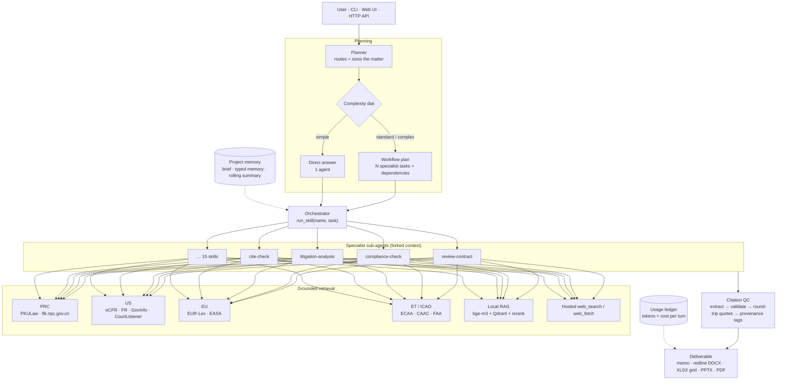

<div align="center">

# ⚖️ Legal AI Harness

**A grounded, multi-jurisdiction agent harness for legal work — not a chat wrapper.**

Plans the matter, fans out specialist sub-agents, pulls primary law from official sources,
round-trips every quotation against the document it came from, and returns a filed-ready
memo, redline, workbook, or deck.

<br/>


-F59E0B)


</div>

> [!IMPORTANT]
> **Not legal advice.** This harness assists with legal workflows. Every output must be
> reviewed by qualified counsel before it is relied on for advice, filings, negotiations,
> or operations. Citation verification is a safety net, not a substitute for a lawyer.

---

## Table of contents

- [What it is](#what-it-is)
- [Architecture](#architecture)
- [Quickstart](#quickstart)
- [Multi-nation: one harness, many legal systems](#multi-nation-one-harness-many-legal-systems)
- [Multi-area: skills and domain packs](#multi-area-skills-and-domain-packs)
- [The tool surface](#the-tool-surface)
- [The grounding stack](#the-grounding-stack)
- [Runtime internals](#runtime-internals)
- [Web UI and HTTP API](#web-ui-and-http-api)
- [Configuration](#configuration)
- [Repository layout](#repository-layout)
- [Testing](#testing)
- [Status and known gaps](#status-and-known-gaps)

---

## What it is

Most "legal AI" is a chat box in front of a general model: it answers fluently, invents
article numbers, and knows one legal system. This repository is the other thing — the
**harness** around the model that makes legal output checkable.

Three commitments shape every design decision:

**1. Primary sources, not recollection.** Statutes, regulations, and judgments are fetched
live from official databases — 国家法律法规数据库, PKULaw, eCFR, the Federal Register,
GovInfo, CourtListener, EUR-Lex, ECAA, CAAC — through in-process connectors and MCP
servers. Model memory is allowed only when it is tagged as such.

**2. Every claim carries a pinpoint, and every pinpoint is verified.** Answers end with a
`## Sources` / `## 资料来源` block in which each entry names a 条款 / article / section / §.
A grounding pass re-fetches the cited documents and round-trips the quoted language against
them; citations that do not survive are flagged, not quietly kept.

**3. Jurisdiction is a first-class axis.** The source hierarchy, citation style, output
language, and visible tool set all change when the jurisdiction changes. PRC law is the
default frame (法律 → 行政法规 → 部门规章 → 规范性文件 → 司法解释 → 指导案例); US and EU
are first-class comparative systems; ET and ICAO ship with the aviation pack.

Around those commitments sit a planner that sizes the work to the question, a sub-agent
runtime that keeps each specialist's context clean, durable project memory for matters
that outlive a single chat, a document layer that writes real DOCX tracked changes and
native PPTX shapes, and a per-turn cost ledger.

---

## Architecture



Both providers see **the same tool surface**: connectors, MCP-discovered tools, RAG,
citation tools, and document writers are all registered as plain function tools. No
provider-native MCP path, no Claude-only or GPT-only branch in the CLI, server, or skills.

---

## Quickstart

```bash
# 1. Environment (Python + Node toolchains live side by side)
conda create -n llm python=3.11 && conda activate llm
pip install -r requirements.txt
npm install                      # web UI + mermaid CLI for flowchart rendering

# 2. Keys — at minimum one provider key
cp .env.example .env             # ANTHROPIC_API_KEY / OPENAI_API_KEY / PKULAW_API_TOKEN / …

# 3. Ask it something
python -m legal_helper run --task "Review this NDA for PRC-law exposure" \
    --input examples/general/sample_commercial_nda.md

# 4. Or use it interactively
python -m legal_helper chat                  # streaming REPL
python -m legal_helper serve --port 8010     # FastAPI + React UI
```

Switch legal systems and domains per invocation:

```bash
python -m legal_helper run --jurisdiction US --task "Does 14 CFR 121 permit this wet lease?"
python -m legal_helper run --domain-pack aviation \
    --task "Review this dry-lease against the playbook" \
    --input examples/aviation/sample_aircraft_lease.md
```

Switch providers with one environment variable — everything else is identical:

```bash
MODEL_PROVIDER=anthropic python -m legal_helper chat
MODEL_PROVIDER=openai    python -m legal_helper chat
```

### API keys and what unlocks what

| Variable | Unlocks | Required? |
|---|---|---|
| `ANTHROPIC_API_KEY` | Claude provider path, hosted web search/fetch | one provider key required |
| `OPENAI_API_KEY` | GPT provider path, hosted web search/fetch | one provider key required |
| `PKULAW_API_TOKEN` | The nine PKULaw MCP sub-services (primary PRC lookup) | optional — falls back to flk.npc.gov.cn |
| `GOVINFO_API_KEY` | GovInfo (US Code, CFR, bills, CRS) | optional |
| `COURTLISTENER_API_TOKEN` | Higher CourtListener rate limits | optional |

No key is ever read from the repository: they come from `.env` or the process environment.

---

## Multi-nation: one harness, many legal systems

Jurisdiction is not a prompt hint — it is a runtime filter. `filter_for(jurisdictions,
packs)` in `legal_helper/connectors/__init__.py` decides which connectors a sub-agent can
even see, so a PRC question is never answered out of the Federal Register by accident, and
an EU question surfaces EUR-Lex and EASA rather than eCFR.

| Jurisdiction | Primary-source stack | Tools the agent gets |
|---|---|---|
| 🇨🇳 **CN** (default) | PKULaw (statutes, 司法案例, 检察文书, 律所文章), 国家法律法规数据库 | `pkulaw_*` (9 MCP sub-services), `flk_npc_search`, `flk_npc_fetch`, `caac_local_search/fetch` |
| 🇺🇸 **US** | eCFR, Federal Register, GovInfo, CourtListener | `ecfr_search/fetch`, `federal_register_search/fetch`, `govinfo_search/fetch`, `courtlistener_search/fetch`, `faa_title14_search`, `drs_search` |
| 🇪🇺 **EU** | EUR-Lex (CELEX + SPARQL), EASA | `eurlex_search/fetch`, `easa_ad_search/fetch`, `easa_ear_index` |
| 🇪🇹 **ET** | Federal Negarit Gazeta mirror, ECAA | `ethiopia_law_search/fetch`, `ecaa_index`, `ecaa_fetch` |
| ✈️ **ICAO** | Chicago Convention + annexes, ICAO docs, Cape Town / IDERA | local RAG collections `icao_doc`, `aviation_treaties` |
| 🇬🇧 **UK** / 🇭🇰 **HK** | Configurable jurisdiction codes; served today by hosted web search + fetch with grounding | `web_search`, `web_fetch`, `fetch_url_to_artifact` |

**Comparative work is the normal case.** Ask "compare CCAR-121 and 14 CFR Part 121 wet-lease
approval" and the planner opens one research task per legal system, each with its own
connectors, then an integration task that reconciles them into a single memo — with the PRC
and US pinpoints kept separate and separately verified.

Three more things travel with the jurisdiction:

- **Citation style** — `gb_t_7714` (PRC), `bluebook` (US), `oscola` (UK), converted by
  `legal_helper/citations/format.py`.
- **Language** — user-facing output follows the user's language; primary sources are quoted
  in the original with a translation added when the languages differ. Internal reasoning is
  free to run in whichever language fits the material.
- **Source hierarchy** — encoded in `legal_helper/playbook/general_playbook.md`, so a PRC
  answer ranks 法律 above 部门规章 above 规范性文件 without being told each time.

---

## Multi-area: skills and domain packs

### 15 practice skills

Each skill is a progressive-disclosure bundle: a `SKILL.md` under 100 lines (the manifest a
sub-agent starts with), `references/` prose it pulls only when needed, `resources/` output
templates, and `scripts/` deterministic helpers. Context stays small until depth is actually
required.

| Skill | What it does |
|---|---|
| `review-contract` | Clause-by-clause review against a configurable playbook, with deviations, business impact, and redlines |
| `triage-nda` | Fast NDA classification — GREEN (sign) / YELLOW (counsel) / RED (full review) |
| `draft-agreement` | Drafts bilingual PRC-first agreements and litigation documents from deal terms |
| `docx-redline` | Native Word tracked changes (`w:ins`/`w:del`) plus anchored margin comments |
| `compliance-check` | Statutes, approvals, filings, and reporting duties for a proposed action, product, or data flow |
| `legal-risk-assessment` | Severity × likelihood matrix with escalation triggers |
| `litigation-analysis` | 案情分析 / 争议焦点归纳 — claims and defenses mapped to legal elements with verified authority |
| `legal-response` | Structured replies to regulators, enforcement letters, and counterparty demands |
| `meeting-briefing` | Negotiation and authority-meeting preparation packs |
| `brief` | Daily scan, topic research, or incident briefing |
| `vendor-check` | Third-party diligence — standing, sanctions screening, certificates, ESG |
| `signature-request` | Multi-party closing and execution packages with a signature matrix |
| `tabular-review` | Document grids — one row per document, one column per question, pinpoint cite in every cell |
| `cite-check` | Round-trips every citation and quotation against its primary source |
| `flowchart` | Process maps and decision trees as editable PPTX shapes or standalone images |

### Domain packs

A **domain pack** layers subject-matter depth on top of the generic skills without forking
them. A pack is a `pack.yaml` (jurisdictions, allowed connectors, RAG collections), a
`playbook.md`, `references/`, and `overlays/<skill>.md` deltas merged into the skill manifest
when the pack is active.

```
legal_helper/domains/aviation/
├── pack.yaml                    # CN · US · EU · ET · ICAO, connectors, RAG collections
├── playbook.md
├── references/ethiopia.md
└── overlays/                    # 13 per-skill deltas
    ├── review-contract.md       # → lease/purchase clause taxonomy, Cape Town, IDERA
    ├── compliance-check.md      # → CAAC / FAA / EASA / ECAA approval chains
    └── …
```

**Aviation** is the populated pack today: CAAC / MOT / FAA / EASA / ICAO, Cape Town
Convention and IDERA, sales and leasing, charter and wet-lease, MRO / Part-145, hull and
liability insurance, accident investigation, ITAR / EAR, CORSIA. Everything aviation-specific
lives inside that directory — the core stays domain-agnostic, and an anatomy test enforces it.

Adding a pack (healthcare, fintech, employment, data protection) means creating a directory
with the same four pieces; it is auto-discovered on the next process start. No core code
changes.

---

## The tool surface

Around 80 in-process function tools, plus the nine PKULaw MCP services and the hosted
web search / fetch pair. They are assembled per turn from the active skill, jurisdictions,
and packs — never all at once, so provider tool schemas stay small.

<details open>
<summary><b>Legal research and retrieval</b></summary>

| Tool | Purpose |
|---|---|
| `legal_source_search` | Jurisdiction-aware fan-out across the connector layer |
| `ecfr_search` · `ecfr_fetch` | US Code of Federal Regulations, current and historical |
| `federal_register_search` · `federal_register_fetch` | Rules, proposed rules, notices |
| `govinfo_search` · `govinfo_fetch` | US Code, CFR, bills, committee and CRS material |
| `courtlistener_search` · `courtlistener_fetch` | US case law and dockets |
| `eurlex_search` · `eurlex_fetch` | EU law by CELEX / title / SPARQL |
| `flk_npc_search` · `flk_npc_fetch` | 国家法律法规数据库 (free PRC fallback) |
| `pkulaw_*` (9 MCP services) | PRC statutes by 条号, semantic statute and case search, 案号 recognition, 法条 traceback, citation validation, doc linking, NL search |
| `ethiopia_law_search/fetch` · `ecaa_index/fetch` | Ethiopian proclamations and ECAA regulations |
| `faa_title14_search` · `drs_search` · `easa_ad_*` · `caac_local_*` | Aviation regulators (pack-gated) |
| `retrieve_legal` | Local RAG over ingested corpora |
| `web_search` · `web_fetch` · `fetch_url_to_artifact` | Hosted search, hosted fetch, and pinned-to-disk fetch |

</details>

<details open>
<summary><b>Citations, grounding, and QC</b></summary>

| Tool | Purpose |
|---|---|
| `extract_citations_tool` | eyecite (US) + PRC regex (案号, 法释, 国函, 国办发, 部令, 《…》第X条) |
| `validate_citations_tool` | Structural and existence checks per jurisdiction |
| `quote_roundtrip_tool` | Does the quoted language actually appear in the source? |
| `ground_answer_tool` | Full pass: find cites → fetch each source → round-trip every quote → grounding score |
| `provenance_audit_tool` | Enforces provenance tags (`[PKULaw]`, `[CourtListener]`, `[model knowledge — verify]`, `[settled — last confirmed YYYY-MM-DD]`) |
| `cite_check_report_tool` | Reviewer-facing verdict table |
| `verification_log_append_tool` | Append-only audit trail of what was checked, when, against what |

</details>

<details open>
<summary><b>Documents in, documents out</b></summary>

| Family | Tools |
|---|---|
| Read / inspect | `read_document`, `inspect_docx`, `inspect_pdf`, `inspect_xlsx`, `inspect_xlsx_range`, `inspect_pptx`, `extract_pdf_tables`, `extract_clauses` |
| Write | `write_docx`, `write_pdf`, `write_xlsx`, `write_pptx` |
| Edit in place | `edit_docx_text`, `edit_xlsx_cells`, `edit_xlsx_cells_checked` (guarded, with protected ranges), `edit_pptx_text`, `copy_xlsx_sheet`, `reshape_docx/xlsx/pptx` |
| Prove the edit | `diff_xlsx`, `render_docx_pages`, `render_xlsx_pages`, `render_pptx_slides`, `render_pdf_pages` |
| PDF surgery | `merge_pdfs`, `split_pdf`, `rotate_pdf_pages` |
| Diagrams | `render_flowchart_image`, native PPTX flowchart shapes |
| Redlining | Real `w:ins` / `w:del` revision marks plus `w:commentRangeStart`-anchored comments — the file a partner can accept or reject in Word |

</details>

<details open>
<summary><b>Orchestration and memory</b></summary>

| Tool | Purpose |
|---|---|
| `run_skill` | Dispatch a task to a specialist sub-agent with a forked context |
| `list_skill_sections` · `read_skill_section` · `list_skill_references` · `read_skill_reference` | Progressive disclosure of skill depth |
| `read_playbook_section` | Pull the relevant playbook section only |
| `project_memory_write` · `project_memory_search` · `project_brief_read` | Durable cross-chat matter memory |
| `list_format_recipes` · `read_format_recipe` | House formatting rules for deliverables |

</details>

---

## The grounding stack

Citation discipline is layered, because a single check catches a single failure mode.

| Layer | Failure it catches | Implementation |
|---|---|---|
| **Extraction** | — | `eyecite` + `reporters-db` for US; regex for PRC 案号 / 法释 / statute pinpoints; EU CELEX |
| **Structural validation** | Malformed or impossible citations | `citations/validate.py`, per-jurisdiction |
| **Existence check** | Cites to documents that do not exist | Connector / PKULaw round-trip; PRC cites stay `could_not_check` until a real lookup promotes them to `verified` |
| **Quote round-trip** | Real source, invented quotation | `citations/groundedness.py` — fetch the source, match the quoted language |
| **Support check** | Real source, real quote, wrong proposition | `cite-check` Mode 2 — does the passage support the claim it is cited for? |
| **Provenance tags** | Model recall presented as retrieval | `citations/provenance.py` — retrieval tags vs. verify tags |
| **Pinpoint audit** | "See the Company Law" with no article | `audit_citations` requires a pinpoint per entry, or an explicit `pinpoint unavailable` / `无法获得具体条款` |

The workflow runs citation QC as its own task when the answer's stakes warrant it, and the
web UI renders the verdict as a reviewer-facing card: what was checked, what passed, what
needs a human.

---

## Runtime internals

**Planner and complexity dial.** A routing pass classifies each request `simple` /
`standard` / `complex` and emits a `WorkflowPlan` of agent tasks with dependencies. Simple
questions get one agent and a direct answer; a comparative multi-jurisdiction memo gets a
fan-out sized to the question plus an integration task. Fan-out is derived from the matter,
never a fixed count.

**Sub-agent runtime.** Each specialist starts from a compact manifest in a forked context
and pulls depth on demand. Only its final block returns to the orchestrator; its internal
turns stay in the JSONL log under the same parent `run_id`. The orchestrator, not the
specialist, authors the user-facing answer.

**Provider parity.** One `Provider` protocol over Anthropic (`claude-opus-4-8`, fast tier
`claude-haiku-4-5`) and OpenAI (`gpt-5.6-terra`, fast tier `gpt-5.6-luna`). Streaming, tool
calls, reasoning traces, prompt caching, and hosted web search all reach parity, and
`tests/test_provider_parity.py` asserts the tool surfaces match.

**Two kinds of memory.** `context.py` keeps a *single long chat* inside the window with a
CJK-aware token estimator, budgeted recent-message selection, and compaction at 60 % of the
window — so a 40-page pasted contract is not truncated to 3 000 characters. `projects.py`
keeps *many chats* on one matter coherent: a hand-authored brief re-injected every turn,
append-only typed memory (fact / decision / task / open_question / glossary / artifact /
risk / source) ranked by salience, a rolling summary, and compaction.

**Local RAG.** bge-m3 embeddings and an embedded Qdrant under `state/qdrant/`, with a
legal-aware hierarchical chunker that respects 第X条 / Article X / § X / clause-numbering
boundaries. Retrieval is hybrid dense + sparse with RRF fusion, over-retrieves 3–4×, then
re-ranks locally with a cross-encoder. Nothing in the retrieval hot path leaves the machine.

```bash
python -m legal_helper.rag.ingest --collection general --seed
python -m legal_helper.rag.ingest --collection aviation --seed
python -m legal_helper.rag.ingest --collection user --path ~/my_legal_docs/
```

**Cost ledger.** Every provider turn — both providers, both the run and streaming paths —
appends normalized token usage to `state/usage/usage-YYYY-MM.jsonl`, priced with
per-provider billing semantics (Anthropic bills cache reads and writes as separate buckets;
OpenAI's cached tokens are a discounted subset of input). `GET /api/usage` serves the month
summary and the UI renders it. Recording never breaks a turn.

**Observability.** JSONL event and turn records under `logs/` capture provider, model,
messages, tool calls, usage, latency, and the parent/sub `run_id` tree — enough to replay
why an answer said what it said.

---

## Web UI and HTTP API

`python -m legal_helper serve --port 8010` starts FastAPI plus a React 19 + Vite front end
with SSE streaming.

- **Live trajectory** — plan, per-agent tasks, tool calls, and reasoning as they happen
- **Sources rail** — every retrieved authority with its provenance tag and pinpoint
- **Citation audit card** — the cite-check verdict inline with the answer
- **Artifacts** — generated DOCX / PDF / XLSX / PPTX attached to the message that produced them
- **Projects** — brief, memory, and compaction controls for long-running matters
- **Cost center** — month-to-date tokens and spend by model
- **Uploads** — drop a contract or PDF into the chat and cite it

Selected endpoints:

```
POST /api/chats                          GET  /api/chats/{id}
POST /api/chats/{id}/messages/stream     GET  /api/chats/{id}/runs/{run_id}/stream
POST /api/chats/{id}/upload              GET  /api/chats/{id}/artifacts/{artifact_id}
GET  /api/projects                       POST /api/projects/{id}/memory
POST /api/projects/{id}/compact          GET  /api/usage
GET  /api/skills                         GET  /domains        GET /jurisdictions
```

---

## Configuration

`config.yaml` holds runtime defaults; `.env` and the process environment override it.

```yaml
provider: openai                  # anthropic | openai

default_jurisdiction: CN          # CN | US | EU | UK | HK | ET | ICAO
secondary_jurisdictions: [US, EU] # comparative systems surfaced when relevant
default_language: zh              # user-facing default; follows the user at runtime
citation_style: gb_t_7714         # gb_t_7714 | bluebook | oscola
active_domain_packs: []           # e.g. [aviation]

anthropic_model: claude-opus-4-8
openai_model: gpt-5.6-terra
max_iterations: 12                # tool-loop ceiling per agent
max_concurrent_agents: auto
max_tokens: 32000                 # per-turn output ceiling
chat_context_token_budget: 16000
chat_compaction_threshold: 0.6

enable_web_search: true
enable_web_fetch: true
```

`.mcp.json` is the MCP registry — remote HTTP servers (the nine PKULaw sub-services), stdio
servers (EUR-Lex), and the in-tree `ccar_aviation` server. Activation is gated by
jurisdiction and active packs. US federal and case-law sources are **direct-API connectors**
in `legal_helper/connectors/`, not MCP servers — nothing to install for them.

---

## Repository layout

```
legal_helper/
├── agent.py            # orchestrator + skill sub-agents
├── workflow.py         # planner-driven executor for the chat surface
├── server.py           # FastAPI + SSE streaming + chat/project/usage API
├── cli.py              # run · chat · serve · project
├── config.py           # settings, jurisdiction codes, citation styles
├── context.py          # within-chat token budgeting + compaction
├── projects.py         # cross-chat brief, typed memory, rolling summary
├── usage.py            # monthly token/cost ledger
├── skills/             # 15 generic, domain-agnostic skills
├── domains/aviation/   # domain pack: pack.yaml, playbook, overlays, references
├── playbook/           # PRC-first global defaults + format recipes
├── connectors/         # in-process primary-source connectors (CN/US/EU/ET/aviation)
├── mcp/                # external MCP boundary: registry, manager, adapter, servers
├── citations/          # extract · validate · round-trip · ground · provenance · audit
├── rag/                # chunker · embeddings · store · hybrid retrieve · rerank · ingest
├── documents/          # docx/pdf/xlsx/pptx writers, redline, diagrams
└── tools/              # function-tool registry assembled per turn

src/                    # React 19 + Vite web UI
tests/                  # anatomy, parity, connectors, citations, RAG, workflow suites
examples/               # fictitious sample contracts and filings
scripts/                # corpus fetchers, expiry flagging, monthly harness review
```

---

## Testing

```bash
pytest -q                                   # full suite
pytest -q tests/test_skill_anatomy.py       # SKILL.md < 100 lines, valid frontmatter,
                                            # no domain strings leaking into the core
pytest -q tests/test_provider_parity.py     # identical tool surface across providers
pytest -q tests/test_citations.py           # extraction + validation
pytest -q tests/test_grounding.py           # quote round-trip
pytest -q tests/test_rag_hybrid.py          # hybrid retrieval + rerank

LEGAL_HELPER_LIVE=1 pytest tests/test_integration_live.py -m live                # Anthropic
LEGAL_HELPER_LIVE_OPENAI=1 pytest tests/test_integration_live_openai.py -m live  # OpenAI
```

The anatomy test is the architectural guardrail: it fails if a skill grows past its manifest
budget, if frontmatter is malformed, or if domain-specific vocabulary leaks out of a pack and
into the generic core.

---

## Status and known gaps

Honest notes, so nobody discovers these the hard way:

- **Aviation is the only populated domain pack.** The pack mechanism is general; the content
  is not yet.
- **UK and HK are configured jurisdictions without dedicated connectors.** They currently run
  on hosted web search plus grounding rather than an official-database connector.
- **Two aviation connectors are disabled in the registry** — `ccar_search`/`ccar_fetch` (the
  CAAC search endpoint moved behind a JS-rendered form) and `drs_fetch` (drs.faa.gov is
  SPA-only). Both are commented in `connectors/__init__.py` with the reason and the workaround.
- **PRC citations stay `could_not_check` until a live PKULaw round-trip.** That is deliberate:
  structural plausibility is not verification.
- **Corpus binaries are not committed.** `legal_helper/rag/corpus/*/manifest.yaml` and the
  fetch scripts are; the PDFs are pulled on demand via `scripts/fetch_aviation_corpus.sh`.
- **Flowchart rendering needs Chrome** for `@mermaid-js/mermaid-cli`.

---

<div align="center">

**Legal AI Harness** · MIT licensed · Built for practitioners who have to be right.

*Not legal advice. Have qualified counsel review every output before relying on it.*

</div>
